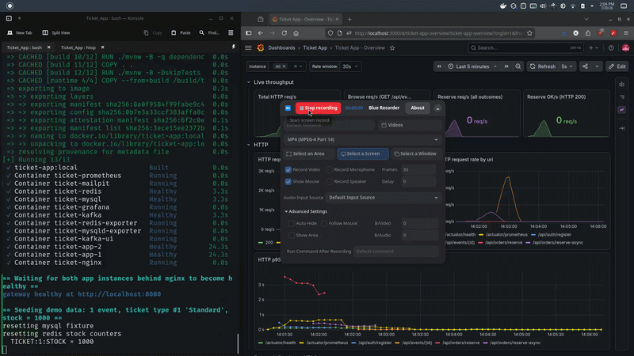
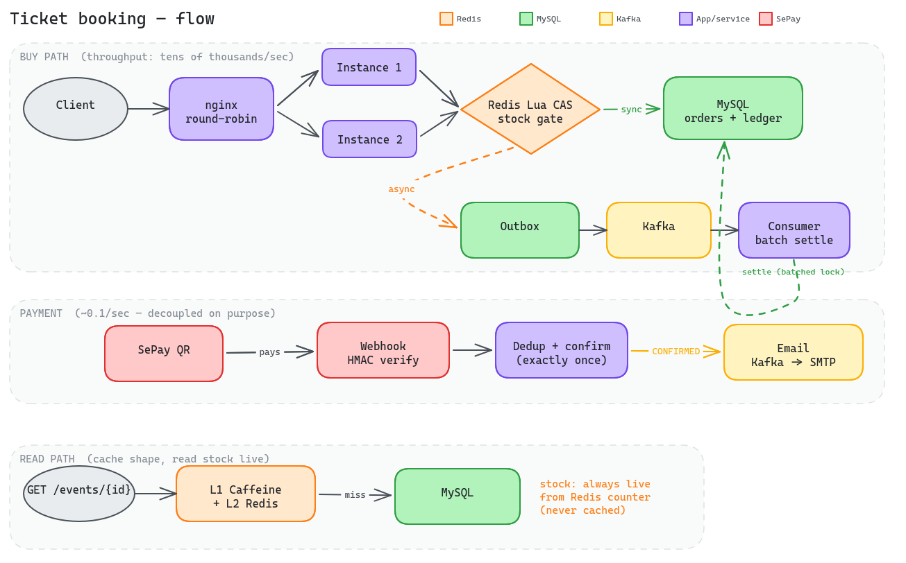
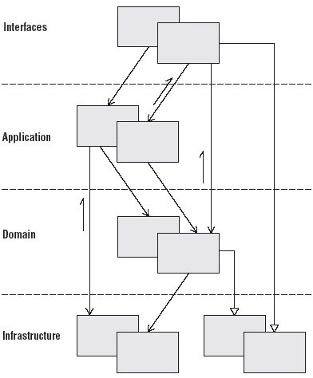

# Ticket App — high-concurrency ticket booking

A from-scratch event ticket booking system (concert/festival, quantity-based ticket
types, no seat map) built around one hard guarantee:

> **Zero oversell under high concurrency** — 2,000 concurrent buyers race for 1,000
> tickets and the database sells **exactly 1,000**, never one more — while the async buy
> path sustains **790 req/s** and the cached browse path **3,279 req/s**.
> _Measured on a 12-core / 14 GB host; every number states its hardware._



There is no UI on purpose. A ticket-buying screen costs weeks and proves nothing about
concurrency; **the repo is the product** — one command reproduces the flash sale on your
own machine, and every headline number is backed by [`docs/performance-report.md`](docs/performance-report.md).

## Quickstart

```bash
git clone https://github.com/cena261/ticket-app && cd Ticket_App
./demo.sh
```

`demo.sh` (needs **docker + compose v2** and **k6** on the host) will:

1. Build the app image and start the stack — mysql, redis, kafka, **two app instances
   behind nginx**, prometheus, grafana (**no ELK**, so it never contends for the cores
   the benchmark measures).
2. Seed one event with 1,000 tickets.
3. Fire 2,000 concurrent requests from 100 distinct users at it (k6).
4. Print the benchmark summary and run the oversell check against the database:

   ```
   Oversell check: PASS - no ticket type sold beyond its stock
   ```

5. Run the **async buy path** with stock that never runs out — the meaningful
   throughput number (~790 req/s), as opposed to the contention run above whose RPS
   is deliberately a correctness gate, not a speed figure.
6. Run the browse scenario across both instances (the read-path cache).

Watch it live in Grafana at <http://localhost:3000> (admin/admin) while it runs.

## Architecture

<!-- Diagram: reserve -> Redis Lua CAS -> Outbox -> Kafka -> settle -> SePay webhook ->
     confirm, plus the expiry/restock sweeper loop. Save it to assets/architecture.png. -->


Full write-up in [`docs/architecture.md`](docs/architecture.md). The four ideas that
matter:

- **Redis Lua CAS is the admission gate.** A single atomic script on the stock counter
  admits or rejects every buyer; a rejected buyer never touches MySQL. Redis is the
  source of truth for availability during a sale — MySQL is the durable ledger that
  catches up. The counter is never rebuilt from a live DB read (the DB always over-counts
  while requests are in flight), and the buy path **fails closed** on a missing key rather
  than inventing stock.
- **Reserve and pay are decoupled** because their rates differ by five orders of
  magnitude. Stock is a natural rate limiter: 300k requests against 100 tickets yield 100
  orders, paid over a 15-minute window ≈ 0.1 payments/sec, versus tens of thousands of
  reserves/sec. Payment is a webhook-driven state change, never synchronous inside
  reserve. The async path defers the DB decrement to a Kafka consumer that **batches** the
  hot-row lock once per ~500 orders — which is why it sustains ~6x the sync path.
- **The cache holds the ticket's shape, never its count.** Metadata (name, prices, sale
  window) is cached L1 Caffeine + L2 Redis with a ~100% hit rate; **stock is read live**
  every request. Caching stock would be strictly slower than no cache (it mutates ~30k/sec,
  so any copy is stale on arrival) and would resurrect the exact bug the counter design
  killed. Because the cached records carry no stock field, the cache *cannot* contradict
  the counter.
- **Coherence is checked against Redis, not the client.** The cache version lives in its
  own Redis key; comparing against a client-supplied version would make two stale copies
  agree and serve stale data (and hand out a free cache-bypass lever). Two app instances
  sit behind nginx **round-robin** (never `ip_hash`) so cross-node staleness is exercised,
  not hidden.

## Results

See [`docs/performance-report.md`](docs/performance-report.md) for the full per-lever log.
Every figure is on the 12-core / 14 GB host, with the load generator co-located (so the
numbers are conservative floors).

| Path | Result | Bound by |
|---|---|---|
| Buy, contention (zero-oversell gate) | **exactly 1,000 sold from 1,000 stock**, 0 errors | correctness |
| Buy, sync throughput | 81 → **132 req/s** (fsync lever, +63%) | one InnoDB row lock |
| Buy, async throughput | 379 → **790 req/s** (6x the sync path) | connection pool |
| Browse, cached (L1+L2) | 1,276 → **3,279 req/s (+157%)**, med 14ms | host CPU |
| Webhook duplicate-storm | **100/100 confirmed exactly once** under ~28k duplicates | correctness |

## Stack

Java 21 (virtual threads), Spring Boot 4.1, Maven multi-module, MySQL 8, Redis + Redisson,
Kafka (KRaft), Spring Security + JWT, Prometheus/Grafana (+ optional ELK), Docker Compose.

Layer-first modules, dependency direction `start -> controller -> application -> infrastructure -> domain`:



| Module | Responsibility |
|--------|----------------|
| `ticket-domain` | Entities, value objects, repository interfaces, domain services |
| `ticket-infrastructure` | JPA impls, Redis/Redisson, Kafka producer, external gateways |
| `ticket-application` | Use-case services, schedulers, Kafka consumers, outbox publisher |
| `ticket-controller` | REST controllers, DTOs, validation |
| `ticket-start` | Spring Boot bootstrap, `application.yml`, metrics registry |

## Build & test

```bash
./mvnw clean verify          # unit + Testcontainers integration tests
```

## Run manually (without demo.sh)

```bash
cd environment
cp .env.example .env         # first time only
docker compose --profile bench --profile app up -d --build   # 2 instances + nginx + monitoring, no ELK
docker compose --profile full  --profile app up -d --build   # the above + ELK (dev/demo)
```

| Surface | URL |
|---------|-----|
| App gateway (nginx → app-1/app-2) | http://localhost:8080 |
| Prometheus | http://localhost:9090 |
| Grafana | http://localhost:3000 (admin/admin) |
| Kafka UI | http://localhost:8081 |
| Mailpit (dev inbox) | http://localhost:8025 |
| Kibana (`full` only) | http://localhost:5601 |

Load-test scripts and how to interpret them: [`benchmark/README.md`](benchmark/README.md).

## Configuration

Copy `environment/.env.example` to `environment/.env` (gitignored) and fill in values.
Never commit secrets. Compose reads `.env`; the app's local defaults live in
`application-local.yml`.
